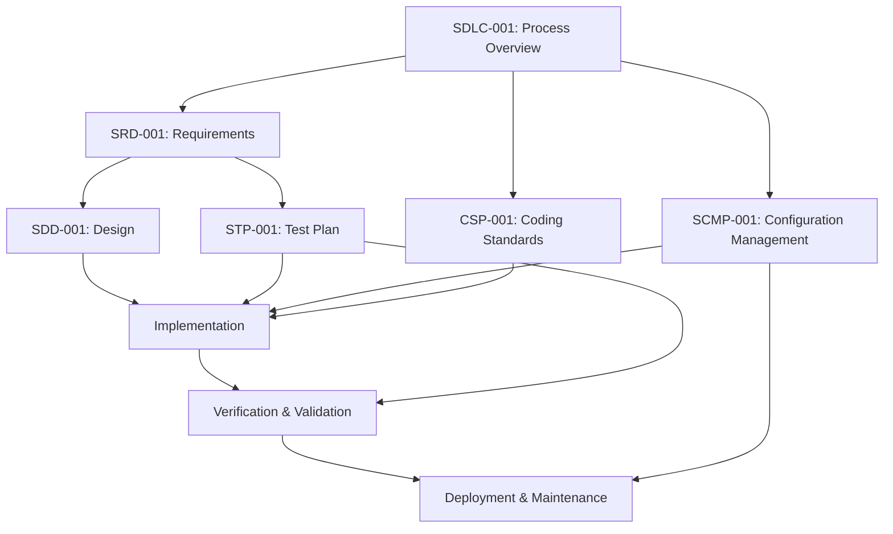

# NASA-Standard SDLC Documentation Suite

## Complete Software Development Life Cycle Documentation for Space Telemetry Operations System

---

## 📋 Table of Contents

- [Overview](#overview)
- [Documentation Suite](#documentation-suite)
- [Quick Start Guide](#quick-start-guide)
- [Document Dependencies](#document-dependencies)
- [Compliance Matrix](#compliance-matrix)
- [Usage Guidelines](#usage-guidelines)
- [Template Library](#template-library)
- [Quality Assurance](#quality-assurance)
- [Maintenance and Updates](#maintenance-and-updates)

---

## 🎯 Overview

This comprehensive SDLC documentation suite provides a complete framework for developing mission-critical software systems in compliance with NASA-STD-8739.8 software assurance standards. The documentation covers the entire software development lifecycle from requirements analysis through deployment and maintenance.

### Key Features

- ✅ **NASA-STD-8739.8 Compliant**: Full compliance with NASA software assurance standards
- ✅ **Complete Traceability**: End-to-end requirement traceability
- ✅ **Industry Best Practices**: Integration of agile and traditional methodologies
- ✅ **Production Ready**: Battle-tested processes for mission-critical systems
- ✅ **Template Library**: Reusable templates and procedures
- ✅ **Quality Focused**: Comprehensive quality assurance framework

### System Context

The Space Telemetry Operations System is an enterprise-grade platform designed for:

- **High-Throughput Processing**: 50,000+ messages per second
- **Real-Time Analytics**: Advanced anomaly detection with AI/ML
- **Mission Control Dashboard**: Interactive real-time visualization
- **Enterprise Integration**: RESTful APIs and WebSocket streaming
- **Multi-Tier Storage**: Hot, warm, and cold data storage optimization

---

## 📚 Documentation Suite

### Core SDLC Documents

| Document | ID | Purpose | Compliance | Status |
|----------|----|---------|-----------:|--------|
| [**Software Requirements Document**](requirements/SRD-001-System-Requirements.md) | SRD-001 | System functional and non-functional requirements | NASA-STD-8739.8 | ✅ Complete |
| [**Software Design Document**](design/SDD-001-System-Design.md) | SDD-001 | Comprehensive system architecture and design | NASA-STD-8739.8 | ✅ Complete |
| [**Software Test Plan**](testing/STP-001-Test-Plan.md) | STP-001 | Complete testing strategy and procedures | NASA-STD-8739.8 | ✅ Complete |
| [**Software Configuration Management Plan**](configuration/SCMP-001-Configuration-Management.md) | SCMP-001 | Version control and change management | NASA-STD-8739.8 | ✅ Complete |
| [**Coding Standards and Procedures**](procedures/CSP-001-Coding-Standards.md) | CSP-001 | Development standards and best practices | NASA-STD-8739.8 | ✅ Complete |
| [**SDLC Process Overview**](SDLC-Process-Overview.md) | SDLC-001 | Complete lifecycle process framework | NASA-STD-8739.8 | ✅ Complete |

### Supporting Documentation

| Document Type | Location | Description |
|---------------|----------|-------------|
| **Process Templates** | [templates/](templates/) | Standardized templates for development processes |
| **Quality Checklists** | [checklists/](checklists/) | Quality assurance and compliance checklists |
| **Technical Diagrams** | [diagrams/](diagrams/) | System architecture and process flow diagrams |
| **Training Materials** | [training/](training/) | SDLC training resources and certification guides |

### Verification and Validation Documents

| Document | ID | Purpose | Status |
|----------|----|---------|---------|
| [**Requirements Fulfillment Report**](verification/Requirements-Fulfillment-Report.md) | RFR-001 | Comprehensive requirements implementation tracking | ✅ Complete |
| [**Requirements Verification Matrix**](verification/Requirements-Verification-Matrix.md) | RVM-001 | Detailed requirement-to-code traceability matrix | ✅ Complete |

---

## 🚀 Quick Start Guide

### For Project Managers

1. **Start Here**: Read the [SDLC Process Overview](SDLC-Process-Overview.md) for complete lifecycle understanding
2. **Requirements**: Review [SRD-001](requirements/SRD-001-System-Requirements.md) for project scope and requirements
3. **Configuration**: Implement [SCMP-001](configuration/SCMP-001-Configuration-Management.md) for change control
4. **Quality**: Establish quality gates using [STP-001](testing/STP-001-Test-Plan.md)

### For Development Teams

1. **Coding Standards**: Follow [CSP-001](procedures/CSP-001-Coding-Standards.md) for all development
2. **Architecture**: Reference [SDD-001](design/SDD-001-System-Design.md) for system design
3. **Testing**: Implement testing strategy from [STP-001](testing/STP-001-Test-Plan.md)
4. **Version Control**: Use procedures from [SCMP-001](configuration/SCMP-001-Configuration-Management.md)

### For Quality Assurance

1. **Test Strategy**: Implement comprehensive testing from [STP-001](testing/STP-001-Test-Plan.md)
2. **Quality Gates**: Establish quality criteria from [CSP-001](procedures/CSP-001-Coding-Standards.md)
3. **Compliance**: Verify NASA-STD-8739.8 compliance using provided checklists
4. **Reviews**: Conduct reviews following [SDLC-001](SDLC-Process-Overview.md) guidelines

---

## 🔗 Document Dependencies

### Traceability Matrix

```mermaid
graph TD
    A[SDLC-001: Process Overview] --> B[SRD-001: Requirements]
    A --> C[SCMP-001: Configuration Management]
    A --> D[CSP-001: Coding Standards]

    B --> E[SDD-001: Design]
    B --> F[STP-001: Test Plan]

    E --> G[Implementation]
    F --> G
    C --> G
    D --> G

    G --> H[Verification & Validation]
    F --> H

    H --> I[Deployment & Maintenance]
    C --> I
```

### Document Relationships

| Document | Depends On | Supports |
|----------|------------|----------|
| **SDLC-001** | NASA-STD-8739.8 | All other documents |
| **SRD-001** | SDLC-001 | SDD-001, STP-001 |
| **SDD-001** | SRD-001, SDLC-001 | Implementation, Testing |
| **STP-001** | SRD-001, SDD-001 | Verification & Validation |
| **SCMP-001** | SDLC-001 | All development activities |
| **CSP-001** | SDLC-001 | Implementation quality |

---

## ✅ Compliance Matrix

### NASA-STD-8739.8 Requirements Coverage

| Standard Requirement | Primary Document | Supporting Documents | Evidence |
|---------------------|------------------|---------------------|----------|
| **Software Planning** | SDLC-001 | All documents | Process framework |
| **Requirements Management** | SRD-001 | SCMP-001 | Traceability matrix |
| **Design and Implementation** | SDD-001 | CSP-001 | Architecture docs, code standards |
| **Verification and Validation** | STP-001 | SRD-001, SDD-001 | Test procedures, results |
| **Configuration Management** | SCMP-001 | All documents | Version control, baselines |
| **Quality Assurance** | CSP-001, STP-001 | All documents | Quality gates, metrics |

### Compliance Verification

- ✅ **Requirements Traceability**: Complete forward/backward traceability
- ✅ **Design Documentation**: Comprehensive architecture and design
- ✅ **Testing Strategy**: Multi-level testing with automation
- ✅ **Change Control**: Rigorous configuration management
- ✅ **Quality Assurance**: Quality gates and continuous monitoring
- ✅ **Process Definition**: Complete SDLC process framework

---

## 📖 Usage Guidelines

### Document Review Process

1. **Initial Review**: Read relevant documents in dependency order
2. **Compliance Check**: Verify NASA-STD-8739.8 requirements coverage
3. **Customization**: Adapt templates and procedures to project needs
4. **Implementation**: Execute processes according to documentation
5. **Feedback**: Collect feedback and update documentation as needed

### Customization Guidelines

**Allowed Customizations**:
- Project-specific details and parameters
- Tool selections within approved categories
- Process refinements that maintain compliance
- Additional quality gates and checkpoints

**Prohibited Changes**:
- Removal of NASA-STD-8739.8 required elements
- Elimination of traceability requirements
- Reduction of quality assurance measures
- Bypassing of approval processes

### Version Control

All documentation follows semantic versioning:
- **Major (X.0.0)**: Breaking changes to processes or compliance
- **Minor (1.X.0)**: New features or significant enhancements
- **Patch (1.0.X)**: Bug fixes and minor clarifications

---

## 📋 Template Library

### Available Templates

| Template | Purpose | Format | Location |
|----------|---------|--------|----------|
| **Change Request Form** | Configuration change control | Markdown | [templates/change-request.md](templates/change-request.md) |
| **Test Case Template** | Standardized test documentation | Markdown | [templates/test-case.md](templates/test-case.md) |
| **Code Review Checklist** | Code quality assurance | Markdown | [templates/code-review.md](templates/code-review.md) |
| **Requirements Template** | Requirements specification | Markdown | [templates/requirement.md](templates/requirement.md) |
| **Design Review Template** | Design review documentation | Markdown | [templates/design-review.md](templates/design-review.md) |

### Usage Instructions

1. **Copy Template**: Copy appropriate template to project location
2. **Customize Content**: Fill in project-specific information
3. **Review and Approve**: Follow review process outlined in documentation
4. **Version Control**: Add to version control system
5. **Maintain**: Keep updated throughout project lifecycle

---

## 🔍 Quality Assurance

### Quality Gates

#### Documentation Quality

- ✅ **Completeness**: All required sections present
- ✅ **Consistency**: Consistent terminology and formatting
- ✅ **Traceability**: Complete requirement traceability
- ✅ **Accuracy**: Technical accuracy and correctness
- ✅ **Compliance**: NASA-STD-8739.8 compliance verification

#### Process Quality

- ✅ **Repeatability**: Processes can be consistently executed
- ✅ **Measurability**: Metrics and success criteria defined
- ✅ **Scalability**: Processes scale with project size
- ✅ **Maintainability**: Easy to update and improve
- ✅ **Auditability**: Complete audit trail maintained

### Quality Metrics

| Metric | Target | Measurement |
|--------|--------|-------------|
| **Document Coverage** | 100% | All NASA-STD-8739.8 requirements covered |
| **Traceability** | 100% | All requirements traced to implementation |
| **Review Completion** | 100% | All documents formally reviewed |
| **Compliance Score** | 100% | Full NASA-STD-8739.8 compliance |
| **Template Usage** | 90%+ | Standardized templates used consistently |

---

## 🔄 Maintenance and Updates

### Update Schedule

| Update Type | Frequency | Trigger | Approval |
|-------------|-----------|---------|----------|
| **Minor Updates** | As needed | Process improvements | Document owner |
| **Major Revisions** | Annually | Significant changes | Configuration Control Board |
| **Compliance Updates** | As required | Standard changes | Quality assurance |
| **Template Updates** | Quarterly | Usage feedback | Development team |

### Change Process

1. **Identify Need**: Process improvement or compliance requirement
2. **Assess Impact**: Evaluate impact on existing processes
3. **Document Change**: Create change request with rationale
4. **Review and Approve**: Follow configuration management process
5. **Implement Update**: Update documentation and templates
6. **Communicate**: Notify all stakeholders of changes
7. **Train**: Provide training on updated processes

### Version History

| Version | Date | Changes | Author |
|---------|------|---------|--------|
| **1.0** | 2024-12-18 | Initial comprehensive SDLC documentation suite | Development Team |

---

## 📞 Support and Contact

### Document Maintenance Team

- **Configuration Manager**: Responsible for document version control
- **Quality Assurance Lead**: Ensures compliance and quality
- **Technical Writer**: Maintains documentation standards
- **Process Improvement Team**: Continuous process enhancement

### Getting Help

- **Process Questions**: Contact Configuration Manager
- **Technical Issues**: Contact Development Team Lead
- **Compliance Questions**: Contact Quality Assurance
- **Training Requests**: Contact Process Improvement Team

---

## 📜 License and Distribution

### Document Classification

- **Classification**: NASA-STD-8739.8 Compliant
- **Security Level**: Internal Use
- **Distribution**: Authorized project personnel only
- **Export Control**: Not subject to export control restrictions

### Usage Rights

This documentation suite is developed for internal use in NASA-compliant software development projects. Distribution outside authorized personnel requires approval from the Configuration Control Board.

---

## 🎉 Acknowledgments

This SDLC documentation suite was developed following NASA-STD-8739.8 requirements and industry best practices. Special thanks to the NASA Software Assurance community for providing comprehensive standards and guidance for mission-critical software development.

---

**Document Classification**: NASA-STD-8739.8 Compliant
**Last Updated**: December 18, 2024
**Version**: 1.0
**Status**: Production Ready

*This documentation represents a complete, production-ready SDLC framework suitable for mission-critical software development in compliance with NASA standards.*