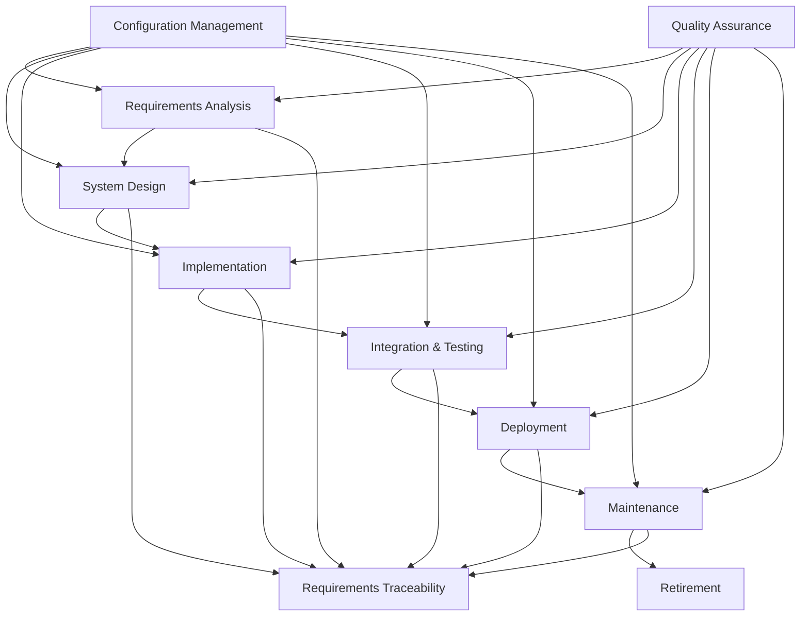
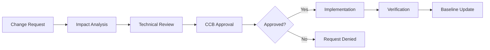
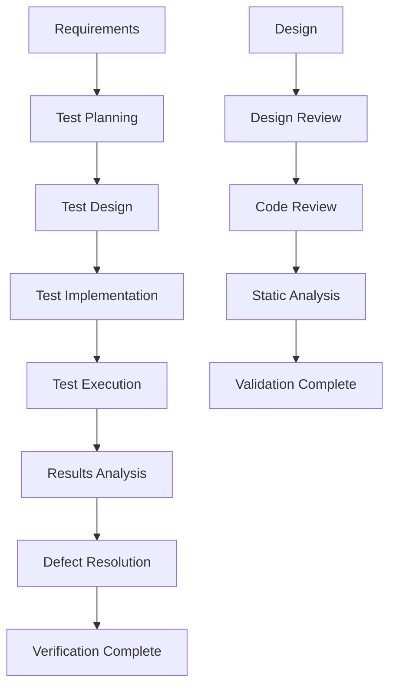
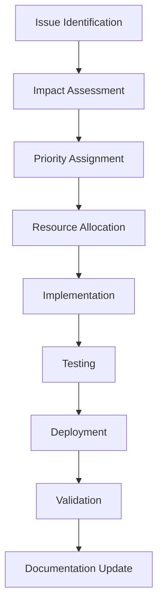
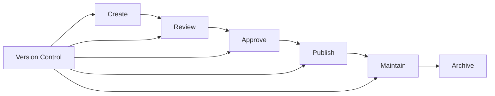

# Software Development Life Cycle (SDLC) Process Overview

## Space Telemetry Operations System

| Document Information ||
|---|---|
| **Document ID** | SDLC-001 |
| **Version** | 1.0 |
| **Date** | December 18, 2024 |
| **Status** | Approved |
| **Classification** | NASA-STD-8739.8 Compliant |

---

## 1. INTRODUCTION

### 1.1 Purpose

This document provides a comprehensive overview of the Software Development Life Cycle (SDLC) process for the Space Telemetry Operations System. It establishes the framework, methodologies, and procedures that govern all software development activities to ensure compliance with NASA-STD-8739.8 requirements.

### 1.2 Scope

This SDLC process applies to all software development activities including:

- Requirements analysis and specification
- System design and architecture
- Implementation and coding
- Testing and verification
- Configuration management
- Deployment and maintenance
- Documentation and quality assurance

### 1.3 Document Organization

This document follows NASA-STD-8739.8 software assurance standards and integrates industry best practices for mission-critical software development.

### 1.4 References

- NASA-STD-8739.8: Software Assurance Standard
- IEEE 12207: Systems and Software Engineering Life Cycle Processes
- CCSDS Standards: Space Data System Standards
- SRD-001, SDD-001, STP-001, SCMP-001, CSP-001: Project documentation suite

---

## 2. SDLC METHODOLOGY OVERVIEW

### 2.1 Development Methodology

The Space Telemetry Operations System employs a hybrid development methodology combining:

- **Agile Development**: Iterative development with continuous integration
- **Waterfall Elements**: Formal documentation and milestone-based approvals
- **DevOps Practices**: Continuous integration/continuous deployment (CI/CD)
- **NASA Standards**: Rigorous quality assurance and configuration management

### 2.2 Life Cycle Model

#### 2.2.1 SDLC Phases



#### 2.2.2 Phase Relationships

| Phase | Duration | Key Deliverables | Entry Criteria | Exit Criteria |
|-------|----------|------------------|----------------|---------------|
| **Requirements** | 3-4 weeks | SRD, Use Cases, Acceptance Criteria | Stakeholder approval | Requirements baseline |
| **Design** | 4-6 weeks | SDD, Architecture, Interface specs | Requirements approval | Design baseline |
| **Implementation** | 8-12 weeks | Source code, Unit tests | Design approval | Code review complete |
| **Testing** | 4-6 weeks | Test results, Defect reports | Code integration | Test criteria met |
| **Deployment** | 1-2 weeks | Production system | Testing complete | System operational |
| **Maintenance** | Ongoing | Updates, Bug fixes | Production deployment | Change requests |

---

## 3. REQUIREMENTS MANAGEMENT PROCESS

### 3.1 Requirements Development

#### 3.1.1 Requirements Elicitation

**Stakeholder Identification**:
- Mission Operations Team
- System Engineers
- End Users (Mission Controllers)
- IT Operations Team
- Security Team
- Compliance Officers

**Elicitation Techniques**:
- Stakeholder interviews and workshops
- Document analysis (existing systems, standards)
- Prototyping and proof-of-concepts
- Use case development
- Risk assessment sessions

#### 3.1.2 Requirements Analysis

```python
# Requirements tracking structure
@dataclass
class Requirement:
    """Software requirement with NASA-STD-8739.8 compliance."""

    requirement_id: str
    title: str
    description: str
    priority: Literal["Critical", "High", "Medium", "Low"]
    category: Literal["Functional", "Performance", "Security", "Interface"]
    source: str
    rationale: str
    acceptance_criteria: List[str]
    dependencies: List[str]
    risks: List[str]
    verification_method: Literal["Test", "Analysis", "Inspection", "Demonstration"]

    # Traceability
    derived_from: Optional[str] = None
    allocated_to: List[str] = field(default_factory=list)
    verified_by: List[str] = field(default_factory=list)

    # Lifecycle tracking
    status: Literal["Draft", "Reviewed", "Approved", "Implemented", "Verified"] = "Draft"
    created_date: datetime = field(default_factory=datetime.utcnow)
    modified_date: datetime = field(default_factory=datetime.utcnow)

    def to_dict(self) -> Dict[str, Any]:
        """Convert requirement to dictionary for export."""
        return asdict(self)
```

#### 3.1.3 Requirements Specification

**Documentation Standards**:
- IEEE 830 Software Requirements Specification format
- Natural language with structured templates
- Formal verification methods where applicable
- Complete traceability matrix maintenance

**Quality Criteria**:
- **Unambiguous**: Single interpretation possible
- **Complete**: All necessary information provided
- **Consistent**: No contradictions with other requirements
- **Verifiable**: Testable through defined methods
- **Modifiable**: Structured for easy updates
- **Traceable**: Linked to sources and design elements

### 3.2 Requirements Management

#### 3.2.1 Change Control Process



#### 3.2.2 Traceability Management

**Forward Traceability**:
- Requirements → Design Elements
- Requirements → Code Modules
- Requirements → Test Cases
- Requirements → Verification Results

**Backward Traceability**:
- Test Cases → Requirements
- Code Modules → Requirements
- Design Elements → Requirements
- Defects → Requirements

---

## 4. DESIGN AND ARCHITECTURE PROCESS

### 4.1 System Architecture

#### 4.1.1 Architectural Design Process

**Design Methodology**:
1. **Architecture Definition**: High-level system structure
2. **Component Design**: Detailed component specifications
3. **Interface Design**: Internal and external interfaces
4. **Data Design**: Database and data structure design
5. **Security Architecture**: Security controls and measures

#### 4.1.2 Design Documentation

**Software Design Document (SDD) Structure**:
- System overview and context
- Architectural design patterns
- Component specifications
- Interface definitions
- Data models and schemas
- Security architecture
- Performance considerations
- Design rationale and trade-offs

### 4.2 Design Review Process

#### 4.2.1 Review Types

| Review Type | Timing | Participants | Focus |
|-------------|--------|--------------|-------|
| **Preliminary Design Review** | After high-level design | Architects, leads | Architecture soundness |
| **Critical Design Review** | After detailed design | Full team | Implementation readiness |
| **Interface Design Review** | Before integration | Integration team | Interface compatibility |
| **Security Design Review** | Before implementation | Security team | Security compliance |

#### 4.2.2 Review Criteria

- **Completeness**: All requirements addressed
- **Correctness**: Design correctly implements requirements
- **Consistency**: Internal consistency and standards compliance
- **Feasibility**: Technical and resource feasibility
- **Maintainability**: Long-term maintenance considerations
- **Performance**: Meets performance requirements
- **Security**: Adequate security measures

---

## 5. IMPLEMENTATION PROCESS

### 5.1 Development Standards

#### 5.1.1 Coding Process

**Development Workflow**:
1. **Task Assignment**: Sprint planning and task allocation
2. **Feature Branch**: Create feature branch from main
3. **Implementation**: Code development following standards
4. **Unit Testing**: Comprehensive unit test coverage
5. **Code Review**: Peer review process
6. **Integration**: Merge to main branch
7. **Continuous Integration**: Automated build and test

#### 5.1.2 Code Quality Gates

```yaml
# Quality gate configuration
quality_gates:
  code_coverage:
    minimum: 90%
    enforcement: blocking

  static_analysis:
    sonarqube_grade: A
    security_hotspots: 0
    code_smells: < 5

  performance:
    build_time: < 5min
    test_execution: < 10min

  security:
    vulnerability_scan: passed
    dependency_check: passed
    secrets_scan: passed
```

### 5.2 Development Environment

#### 5.2.1 Environment Setup

**Development Tools**:
- **IDE**: VS Code with standardized extensions
- **Version Control**: Git with standardized workflow
- **Containerization**: Docker for consistent environments
- **Database**: PostgreSQL, Redis for development
- **Testing**: pytest (Python), Jest (JavaScript)
- **Documentation**: Markdown with automated generation

**Environment Configuration**:
```yaml
# Development environment specification
development_environment:
  python_version: "3.11"
  node_version: "18.x"
  database:
    postgresql: "15.x"
    redis: "7.x"
  containers:
    base_images:
      python: "python:3.11-slim"
      node: "node:18-alpine"
  testing:
    coverage_target: 90%
    test_data: synthetic
  monitoring:
    logging_level: DEBUG
    metrics_collection: enabled
```

---

## 6. TESTING AND VERIFICATION PROCESS

### 6.1 Testing Strategy

#### 6.1.1 Test Levels

**Test Pyramid Implementation**:
- **Unit Tests (70%)**: Component-level testing
- **Integration Tests (20%)**: Service interaction testing
- **End-to-End Tests (10%)**: Full system workflow testing

#### 6.1.2 Test Types

| Test Type | Purpose | Automation | Frequency |
|-----------|---------|------------|-----------|
| **Unit Testing** | Component functionality | Fully automated | Every commit |
| **Integration Testing** | Component interaction | Automated | Daily |
| **System Testing** | End-to-end functionality | Semi-automated | Weekly |
| **Performance Testing** | Scalability and speed | Automated | Sprint end |
| **Security Testing** | Vulnerability assessment | Semi-automated | Sprint end |
| **Acceptance Testing** | User requirements | Manual | Release candidate |

### 6.2 Verification and Validation

#### 6.2.1 V&V Process



#### 6.2.2 Verification Methods

| Requirement Type | Verification Method | Success Criteria |
|------------------|-------------------|------------------|
| **Functional** | Testing | All test cases pass |
| **Performance** | Analysis + Testing | Performance targets met |
| **Interface** | Testing + Inspection | Interface specs compliance |
| **Security** | Testing + Analysis | Security requirements met |

---

## 7. CONFIGURATION MANAGEMENT PROCESS

### 7.1 Configuration Control

#### 7.1.1 Configuration Items

**Software Configuration Items (SCIs)**:
- Source code and libraries
- Documentation and specifications
- Test cases and test data
- Build scripts and configuration files
- Database schemas and migration scripts

#### 7.1.2 Version Control Strategy

**Branching Model**:
```
main (production)
├── develop (integration)
├── feature/feature-name
├── release/version-number
└── hotfix/critical-fix
```

**Version Numbering**: Semantic versioning (MAJOR.MINOR.PATCH)
- **MAJOR**: Breaking changes
- **MINOR**: New features (backward compatible)
- **PATCH**: Bug fixes (backward compatible)

### 7.2 Change Management

#### 7.2.1 Change Control Board (CCB)

**CCB Composition**:
- Configuration Manager (Chair)
- Technical Lead
- Quality Assurance Representative
- Project Manager
- Customer Representative (as needed)

**CCB Responsibilities**:
- Evaluate change requests
- Authorize configuration changes
- Ensure change implementation quality
- Maintain configuration baselines

---

## 8. QUALITY ASSURANCE PROCESS

### 8.1 Quality Management

#### 8.1.1 Quality Objectives

- **Correctness**: Software performs as specified
- **Reliability**: System operates without failure
- **Performance**: Meets speed and throughput requirements
- **Security**: Protects against threats and vulnerabilities
- **Maintainability**: Easy to modify and enhance
- **Usability**: User-friendly interface and operation

#### 8.1.2 Quality Metrics

```python
# Quality metrics tracking
class QualityMetrics:
    """Track and report quality metrics."""

    def __init__(self):
        self.code_metrics = {
            'coverage': 0.0,
            'complexity': 0.0,
            'maintainability_index': 0.0,
            'technical_debt_ratio': 0.0
        }

        self.process_metrics = {
            'defect_density': 0.0,
            'defect_removal_efficiency': 0.0,
            'review_effectiveness': 0.0,
            'test_effectiveness': 0.0
        }

        self.product_metrics = {
            'performance_score': 0.0,
            'security_score': 0.0,
            'usability_score': 0.0,
            'reliability_score': 0.0
        }

    def calculate_quality_score(self) -> float:
        """Calculate overall quality score."""
        weights = {
            'code': 0.3,
            'process': 0.3,
            'product': 0.4
        }

        code_score = sum(self.code_metrics.values()) / len(self.code_metrics)
        process_score = sum(self.process_metrics.values()) / len(self.process_metrics)
        product_score = sum(self.product_metrics.values()) / len(self.product_metrics)

        return (
            code_score * weights['code'] +
            process_score * weights['process'] +
            product_score * weights['product']
        )
```

### 8.2 Quality Control

#### 8.2.1 Review Process

**Review Types and Schedule**:
- **Daily**: Code reviews for all changes
- **Weekly**: Sprint reviews and retrospectives
- **Monthly**: Architecture and design reviews
- **Quarterly**: Process improvement reviews
- **Per Release**: Quality gate reviews

#### 8.2.2 Quality Gates

**Release Quality Gates**:
1. **Code Quality**: 90%+ test coverage, no critical issues
2. **Security**: No high/critical vulnerabilities
3. **Performance**: All performance requirements met
4. **Documentation**: Complete and up-to-date
5. **Compliance**: NASA-STD-8739.8 requirements satisfied

---

## 9. DEPLOYMENT AND MAINTENANCE PROCESS

### 9.1 Deployment Strategy

#### 9.1.1 Deployment Pipeline

```yaml
# CI/CD Pipeline Configuration
deployment_pipeline:
  stages:
    - name: "Build"
      steps:
        - checkout_code
        - install_dependencies
        - compile_code
        - run_unit_tests

    - name: "Test"
      steps:
        - integration_tests
        - security_scan
        - performance_tests
        - quality_gates

    - name: "Package"
      steps:
        - build_containers
        - create_artifacts
        - sign_packages

    - name: "Deploy"
      environments:
        - staging
        - production
      approval_required: true
      rollback_enabled: true
```

#### 9.1.2 Deployment Environments

| Environment | Purpose | Data | Access | Deployment Method |
|-------------|---------|------|--------|-------------------|
| **Development** | Feature development | Synthetic | Developers | Automatic |
| **Integration** | Service integration | Test data | QA Team | Automatic |
| **Staging** | Pre-production testing | Production-like | Limited | Manual approval |
| **Production** | Live operations | Real data | Operations | Manual approval |

### 9.2 Maintenance Process

#### 9.2.1 Maintenance Types

- **Corrective**: Bug fixes and defect resolution
- **Adaptive**: Changes for new environments or requirements
- **Perfective**: Performance improvements and optimizations
- **Preventive**: Proactive changes to prevent future issues

#### 9.2.2 Maintenance Workflow



---

## 10. RISK MANAGEMENT

### 10.1 Risk Assessment

#### 10.1.1 Risk Categories

| Risk Category | Examples | Mitigation Strategies |
|---------------|----------|----------------------|
| **Technical** | Performance bottlenecks, integration issues | Prototyping, technical reviews |
| **Schedule** | Delayed deliveries, resource constraints | Agile methodology, buffer time |
| **Quality** | Defects, requirement gaps | Comprehensive testing, reviews |
| **Security** | Vulnerabilities, data breaches | Security testing, code analysis |
| **Operational** | Deployment failures, system outages | Rollback procedures, monitoring |

#### 10.1.2 Risk Monitoring

```python
# Risk tracking system
class RiskTracker:
    """Track and monitor project risks."""

    def __init__(self):
        self.risks = []
        self.risk_threshold = 0.7  # High risk threshold

    def assess_risk(self, risk_item: Dict[str, Any]) -> float:
        """Assess risk probability and impact."""
        probability = risk_item.get('probability', 0.5)
        impact = risk_item.get('impact', 0.5)
        return probability * impact

    def monitor_risks(self) -> List[Dict[str, Any]]:
        """Monitor high-priority risks."""
        high_risks = []
        for risk in self.risks:
            risk_score = self.assess_risk(risk)
            if risk_score >= self.risk_threshold:
                high_risks.append({
                    'risk_id': risk['id'],
                    'description': risk['description'],
                    'score': risk_score,
                    'mitigation': risk.get('mitigation', 'None defined')
                })
        return high_risks
```

---

## 11. COMPLIANCE AND STANDARDS

### 11.1 NASA-STD-8739.8 Compliance

#### 11.1.1 Compliance Matrix

| Standard Requirement | Implementation | Evidence Location |
|---------------------|----------------|-------------------|
| **Software Planning** | SDLC Process Documentation | This document |
| **Requirements Management** | Requirements traceability system | SRD-001 |
| **Design and Implementation** | Design reviews and coding standards | SDD-001, CSP-001 |
| **Testing and Verification** | Comprehensive test strategy | STP-001 |
| **Configuration Management** | Version control and change management | SCMP-001 |
| **Quality Assurance** | Quality gates and metrics | Quality reports |

#### 11.1.2 Audit and Assessment

**Internal Audits**:
- Monthly process compliance audits
- Quarterly quality assessments
- Annual comprehensive reviews

**External Assessments**:
- Independent verification and validation
- Third-party security assessments
- NASA compliance reviews

---

## 12. CONTINUOUS IMPROVEMENT

### 12.1 Process Improvement

#### 12.1.1 Improvement Framework

**PDCA Cycle Implementation**:
- **Plan**: Identify improvement opportunities
- **Do**: Implement process changes
- **Check**: Measure and evaluate results
- **Act**: Standardize successful improvements

#### 12.1.2 Metrics and Feedback

**Process Metrics**:
- Development velocity and throughput
- Defect rates and resolution times
- Code quality and maintainability indices
- Customer satisfaction and user feedback

**Improvement Actions**:
- Process optimization based on metrics
- Tool evaluation and adoption
- Training and skill development
- Best practice sharing and standardization

---

## 13. DOCUMENTATION MANAGEMENT

### 13.1 Documentation Standards

#### 13.1.1 Document Types

| Document Type | Template | Review Process | Maintenance |
|---------------|----------|----------------|-------------|
| **Requirements** | IEEE 830 format | Formal review, CCB approval | Version controlled |
| **Design** | Standard SDD template | Technical review, approval | Synchronized with code |
| **Test Plans** | IEEE 829 format | QA review, approval | Updated per release |
| **User Guides** | Standard template | User review, approval | Updated per release |
| **API Documentation** | OpenAPI 3.0 | Automated generation | Continuous |

#### 13.1.2 Documentation Lifecycle



---

## 14. PROJECT TEAM ORGANIZATION

### 14.1 Team Structure

#### 14.1.1 Roles and Responsibilities

| Role | Responsibilities | Authority |
|------|------------------|-----------|
| **Project Manager** | Overall project coordination | Project decisions |
| **Technical Lead** | Technical direction and architecture | Technical decisions |
| **Development Team** | Software implementation | Implementation choices |
| **QA Team** | Testing and quality assurance | Quality gates |
| **DevOps Engineer** | CI/CD and infrastructure | Deployment decisions |
| **Configuration Manager** | Version control and baselines | Configuration changes |

#### 14.1.2 Communication Plan

**Communication Channels**:
- **Daily Standups**: Development team coordination
- **Weekly Status**: Project stakeholder updates
- **Monthly Reviews**: Technical and business reviews
- **Quarterly Planning**: Strategic planning and roadmap updates

---

## 15. APPENDICES

### 15.1 Process Templates

[Links to process templates and forms]

### 15.2 Tool Configurations

[Standard tool configurations and setup guides]

### 15.3 Training Materials

[SDLC training resources and certification requirements]

### 15.4 Compliance Checklists

[NASA-STD-8739.8 compliance verification checklists]

---

## 16. APPROVAL

| Role | Name | Signature | Date |
|------|------|-----------|------|
| **Project Manager** | Project Lead | [Digital Signature] | 2024-12-18 |
| **Technical Lead** | Engineering Manager | [Digital Signature] | 2024-12-18 |
| **Quality Assurance** | QA Manager | [Digital Signature] | 2024-12-18 |
| **Configuration Manager** | CM Lead | [Digital Signature] | 2024-12-18 |

---

**Document Classification**: NASA-STD-8739.8 Compliant
**Security Level**: Internal Use
**Distribution**: All project team members, management, quality assurance

## End of Document
